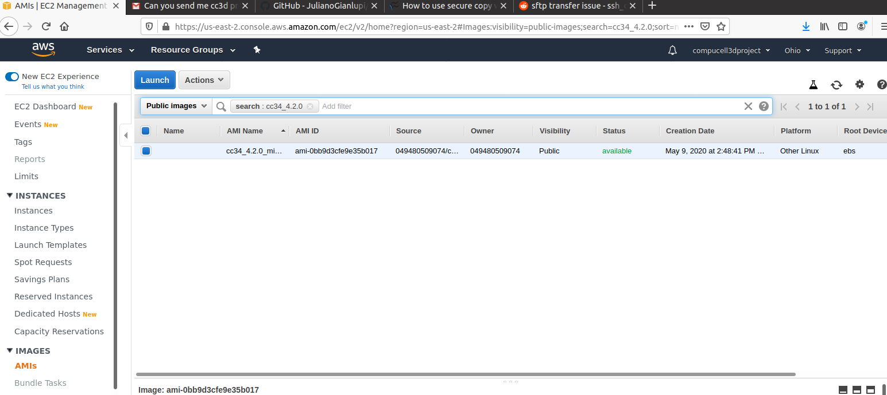
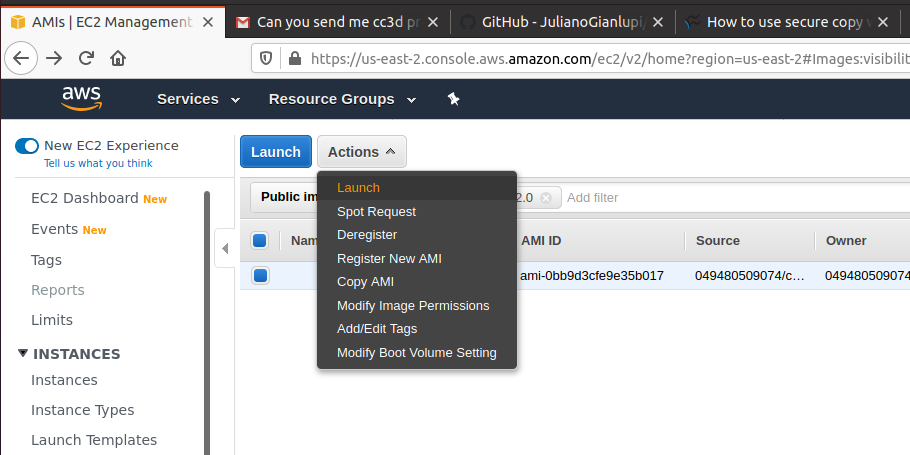

For general instructions p[lease checkout this link.

https://docs.aws.amazon.com/AWSEC2/latest/UserGuide/AccessingInstancesLinux.html

In this writeup we will show how to setup CC3D on already existing AWS Ubuntu 18.04 image

We are assuming that we are connecting from a Linux machine.

setting up private key
-----------------------

After generating AWS keys during AWS instance creation we save them in a secure folder, ideally, ``~./ssh`
on local machine. Next, we change private key to have file permissions set to  400

.. code-block:: console

    chmod 400 <path_to_private_key>

connect
-------

To connect to AWS instance without X11 forwarding (e.g. right after creating AWS instance) use the following:

.. code-block:: console

    ssh -i <full path to private key for a given instance> ec2-3-135-208-xxx.us-east-2.compute.amazonaws.com

the ec2-3-135-208-xxx.us-east-2.compute.amazonaws.com can be found on the instance page

Installations
-------------

After initial login run

.. code-block:: console

    sudo apt-get update

This will fetch ubuntu packages so that you can install some on your system

then you can install all the stuff you want to

Install CC3D
------------

On AWS image with ubuntu 18.04 we do the following:

We first install ``xterm`` to make sure we can forward X11 windows

.. code-block:: console

    sudo apt-get install xterm

This single command will install all dependencies needed to forward X11 windows

Next, we disconnect and connect again to  to AWS instance but this time we will request  X11 window forwarding
so that we can see and interact with GUI's

.. code-block:: console

    ssh -X -i <full path to private key for a given instance> ec2-3-135-208-xxx.us-east-2.compute.amazonaws.com

Notice ``-X`` switch that enables X11 window forwarding

.. code-block:: console

    wget wget https://sourceforge.net/projects/cc3d/files/4.2.0/linux/Ubuntu_18.04_64bit/CC3D_4.2.0_ubuntu_18.04_64bit.tar.gz

once the download finishes we install it as follows:

.. code-block:: console

    tar -xvf CC3D_4.2.0_ubuntu_18.04_64bit.tar.gz

Using Existing AMI image to launch AWS instance with CC3D installed
-------------------------------------------------------------------

The easiest way to install start using CC3D on AWS is to use existing image with CC#D installation.
In this example we will use publicly available Amazon Machine Image (AMI) called ``cc34_4.2.0_minimal``.
Yes, there is a typo in the image name but it does not matter what the image is called.

Step 1
~~~~~~

Locate ``cc34_4.2.0_minimal`` in publicly available AMIs. To do so click AMIs in the ``Images`` link in the
left panel of AWS console

In the search box panel make sure you select "Public Images" from pull down menu and type ``cc34_4.2.0_minimal``
in the actual search box. Select this image

|AMI_image_search|

Step 2
~~~~~~

Launch a virtual machine with this image. Note, this image has already CC3D installed so after you launch
the virtual machine with this image you will be ready to run simulations. Launching is as easy as
clicking ``Launch`` button:

|action_launch|

This will take you to a page where you will select actual virtual machine configuration. Make sure you
choose machine specs that are suitable for your needs. Here we have chosen ``t2.xlarge`` instance with 3 CPUs
and 16 GB RAM. When selecting the machine make sure you are aware of costs. Larger machines cost more

|select_instance_configuration|

Click ``Review and Launch`` and after few minutes the instance will be ready for use.

You might be asked to generate ssh key that you will use to authenticate.
Make sure you do it during first launch. Later, when you start new instances of virtual machines you might
reuse existing key. Make sure you store this key in secure location

Step 3
~~~~~~

Connect to the instance.IN the left-hand panel click instances and verify that your newly launched machine
is ready . It may take few minutes for machine to be ready so be aware of this.  Once you see machine is ready
to use, select it (blue square) and click ``Connect`` button. It will display instructions on how to
connect to your machine (you will see actual IP address in this pop up dialog)

|connect_to_launched_instance|

The actual command i typed was as follows:

.. code-block:: console

    ssh -Y -i ~/.ssh/ubuntu_18_t2_medium.pem ubuntu@ec2-18-217-205-200.us-east-2.compute.amazonaws.com

where ``-Y`` switch activates X11 Window forwarding and ``-i ~/.ssh/ubuntu_18_t2_medium.pem`` is a location of
a private key that I generated in Step 2. Note that in your case that actual IP address of
the virtual machine might differ but you will see this in the pop-up dialog that displays after you click
``Connect``

.. warning::

    make sure you are ssh-ing as user ``ubuntu``. simply change ``root@ec2-18-217-20...`` to ``ubuntu@ec2-18-217-20...`` in the ssh command

.. |select_instance_configuration| image:: images/select_instance_configuration.png
   :width: 7.7000in
   :height: 4.25in

.. |connect_to_launched_instance| image:: images/connect_to_launched_instance.png
   :width: 7.7000in
   :height: 4.7in

